# Cycle scenario gallery

Illustrative user scenarios for the **Home hero data-source / confidence** rules and **period boundary detection**, compared with what the committed app does today.

**Sources**

- Downloads: `ritu-hero-card-data-source-spec.html`, `ritu-period-boundary-detection-spec.html`
- Repo: `docs/cycle-classification-spec.html`, `lib/core/cycle/*`, `lib/features/home/home_screen.dart`

**Status legend**

| Tag | Meaning |
| --- | --- |
| In app | Behavior matches committed code |
| Partial | Related UI/math exists; gate or copy differs from Downloads specs |
| Spec only | Downloads rule not implemented yet |

**Card vocabulary (illustrations)**

| State | Look |
| --- | --- |
| Neutral | Big day count, no phase name |
| Confident | Exact day + phase, full opacity |
| Hedged | `~Day`, “probably [phase]”, reduced opacity |
| Unpredictable | Menstrual on bleed days; honest “days since” otherwise |
| Empty | No start date yet |
| Overdue / nudge | Longer-than-usual fallback; Home “Still on your period?” |

---

## Part A — Hero confidence

### 1. Pure live logging → Confident

**Status:** Partial  
**Summary:** No onboarding dates. Four Logged starts close three clean cycles; classification and the clean-cycle gate open together.

**Rules**

- Neutral until classification min (3 cycles / 4 starts) **and** one Logged→Logged cycle
- First unlock after a clean cycle → Confident if Regular (no Hedged stop)
- App today: classification alone; same outcome on this path

```mermaid
gantt
    title Pure live logging
    dateFormat X
    axisFormat Day %s
    section Period starts
    d0 Logged           :milestone, m0, 1, 1s
    d1 Logged           :milestone, m1, 29, 1s
    d2 Logged           :milestone, m2, 57, 1s
    d3 Logged           :milestone, m3, 85, 1s
    section Cycles
    C1 clean            :c1, 1, 28s
    C2 clean            :c2, 29, 28s
    C3 clean            :c3, 57, 28s
    C4 current          :active, c4, 85, 8s
    section Hero card
    Neutral             :crit, n1, 1, 84s
    Confident           :done, n2, 85, 16s
```

**Spec target UI** (Confident)

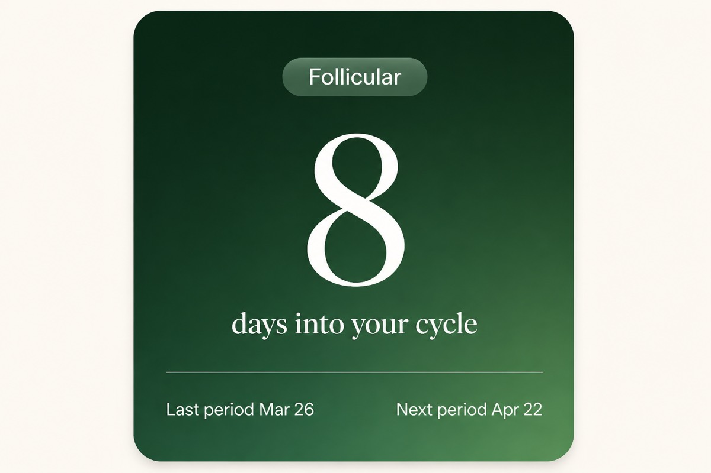

| Field | Value |
| --- | --- |
| Day | 8 |
| Subtitle | days into your cycle |
| Badge | Follicular |
| Left | Last period Mar 26 |
| Right | Next period Apr 22 |

**App today:** Same Confident / phase card once 3 completed cycles exist.

---

### 2. One Manual last-period + live logs

**Status:** Partial  
**Summary:** Onboarding last-period is Manual (Downloads spec). Cycles: Manual→Logged (hedged ends), then two clean Logged→Logged. Gate opens at d3 with Confident.

**Rules**

- A Manual date hedges **both** adjacent cycles (shared boundary)
- Clean cycle appears at C2; classification min at C3 → Confident immediately
- **Discrepancy:** app tags `onboarding_last` as Logged (`isManual = false`)

```mermaid
gantt
    title One Manual last-period plus live logs
    dateFormat X
    axisFormat Day %s
    section Period starts
    d0 Manual           :crit, milestone, m0, 1, 1s
    d1 Logged           :milestone, m1, 29, 1s
    d2 Logged           :milestone, m2, 57, 1s
    d3 Logged           :milestone, m3, 85, 1s
    section Cycle trust
    C1 hedged ends      :crit, c1, 1, 28s
    C2 clean            :done, c2, 29, 28s
    C3 clean            :done, c3, 57, 28s
    C4 current          :active, c4, 85, 8s
    section Hero card
    Neutral             :crit, n1, 1, 84s
    Confident           :done, n2, 85, 16s
```

**Spec target UI** (Confident)

**App today:** Same UI outcome here, but for the wrong reason (onboarding last-period already counts as Logged).

---

### 3. Four Manual dates at onboarding

**Status:** Spec only  
**Summary:** Classification is eligible at signup, but Neutral holds until two live Logged starts produce one clean cycle (d4→d5).

**Rules**

- §8–9: 4 Manual → still need **2** Logged dates before Neutral ends
- Never show Hedged while waiting on the gate — Neutral only
- App gap: phase card appears as soon as 4 starts exist

```mermaid
gantt
    title Four Manual at onboarding
    dateFormat X
    axisFormat Day %s
    section Period starts
    d0 Manual           :crit, milestone, m0, 1, 1s
    d1 Manual           :crit, milestone, m1, 29, 1s
    d2 Manual           :crit, milestone, m2, 57, 1s
    d3 Manual           :crit, milestone, m3, 85, 1s
    d4 Logged           :milestone, m4, 113, 1s
    d5 Logged           :milestone, m5, 141, 1s
    section Gates
    Class eligible      :milestone, g1, 85, 1s
    Still Neutral       :crit, g2, 113, 28s
    Clean unlock        :done, g3, 141, 20s
    section Hero spec
    Neutral             :crit, s1, 1, 140s
    Confident           :done, s2, 141, 20s
    section Hero app today
    Unclassified        :u1, 1, 84s
    Phase card early    :active, u2, 85, 76s
```

**Spec target UI while waiting** (Neutral — even though classification math already ran)

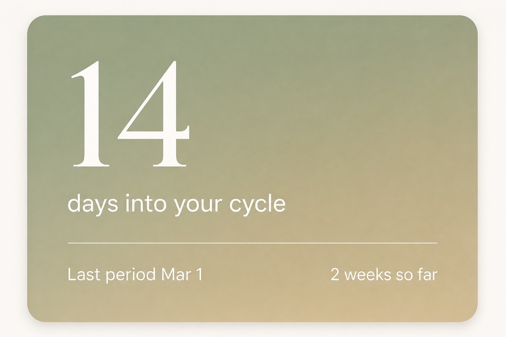

| Field | Value |
| --- | --- |
| Day | 28 |
| Subtitle | days into your cycle |
| Left | Last period May 1 |
| Right | 2 cycles so far |

**App today:** Confident / phase card immediately once 4 Manual starts exist — no Logged/Manual data-trust gate.

---

### 4. Skipped last period — empty welcome

**Status:** In app  
**Summary:** No start date. Day-count math is meaningless; show a stable empty state until the first live log.

**Rules**

- §11.1: stable empty state — never imply lateness
- First live log tags Logged and starts Day 1 (0-manual path)

```mermaid
gantt
    title Empty welcome
    dateFormat X
    axisFormat Day %s
    section Period starts
    none yet            :crit, p1, 1, 30s
    section Hero card
    Empty welcome       :active, h1, 1, 30s
```

**Spec target UI**

| Field | Value |
| --- | --- |
| Day | — |
| Subtitle | Log your first period to get started. |

**App today:** Same idea; copy is “No period logged yet” / “Add your last period in Settings”.

---

### 5. Stops logging — calendar vs logged counter

**Status:** Partial  
**Summary:** Logged daily for 1 week, then silent. Big day number keeps climbing; right-side “weeks logged” freezes.

**Rules**

- §11.2: big number = calendar; trailing = actual log count (freeze)
- Soft nudge ~45 days — copy only, never “overdue” pre-classification
- App: trailing uses calendar weeks (“N weeks so far”), so inactivity still advances it

```mermaid
gantt
    title Inactivity freeze
    dateFormat X
    axisFormat Day %s
    section Daily logs
    Logged              :done, l1, 1, 7s
    No opens            :crit, l2, 8, 35s
    section Calendar day count
    Climbs to 42        :active, c1, 1, 42s
    section Right-side text
    No history yet      :n1, 1, 6s
    1 week logged frozen :crit, n2, 7, 36s
```

**Spec target UI** (Neutral, frozen trailing)

| Field | Spec | App today |
| --- | --- | --- |
| Day | 42 | 42 |
| Subtitle | days into your cycle | days into your cycle |
| Right | **1 week logged** (frozen) | **6 weeks so far** (calendar) |

---

### 6. Regular — expected period doesn’t arrive

**Status:** Spec only  
**Summary:** Classified Regular with C=28. Day count passes personal average → drop phase strip, neutral “running longer than usual”.

**Rules**

- §11.3 Regular: day > personal C → neutral overdue copy
- Variable: day > longest sample → same fallback
- Does not change classification; self-resolves on next period log

```mermaid
gantt
    title Overdue Regular cycle
    dateFormat X
    axisFormat Day %s
    section Phase model
    Menstrual           :crit, p1, 1, 5s
    Follicular          :done, p2, 6, 6s
    Ovulatory           :p3, 12, 3s
    Luteal              :p4, 15, 14s
    Past C              :crit, p5, 29, 7s
    section Hero card
    Confident phases    :done, h1, 1, 28s
    Overdue fallback    :crit, h2, 29, 12s
```

**Spec target UI**

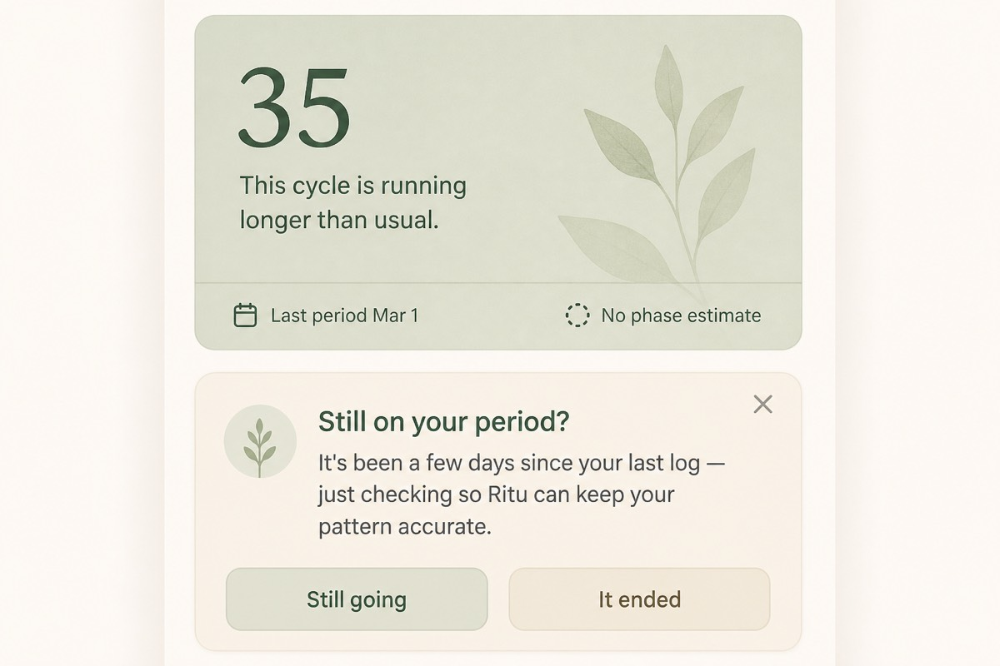

| Field | Value |
| --- | --- |
| Day | 35 |
| Subtitle | This cycle is running longer than usual. |
| Right | No phase estimate |

**App today:** Phase card / next-period label keep extrapolating past C — no overdue branch.

---

### 7. Later “Add a date” drops Confident → Hedged

**Status:** Spec only  
**Summary:** Was Confident with a clean window. Settings recovery inserts a Manual start that becomes the only shared boundary — display drops to Hedged until a new clean cycle.

**Rules**

- §6.3: Hedged is for **post-unlock** Manual recovery, not first unlock
- Manual date hedges both adjacent cycles
- Ages out of the rolling 6-cycle window as live logs accumulate

```mermaid
gantt
    title Manual recovery then Hedged
    dateFormat X
    axisFormat Day %s
    section Rolling window
    Prior clean         :done, w1, 1, 10s
    Add a date Manual   :crit, milestone, w2, 11, 1s
    No clean left       :crit, w3, 12, 9s
    section Hero card
    Confident           :done, h1, 1, 10s
    Hedged              :crit, h2, 11, 20s
```

**Spec target UI** (Hedged)

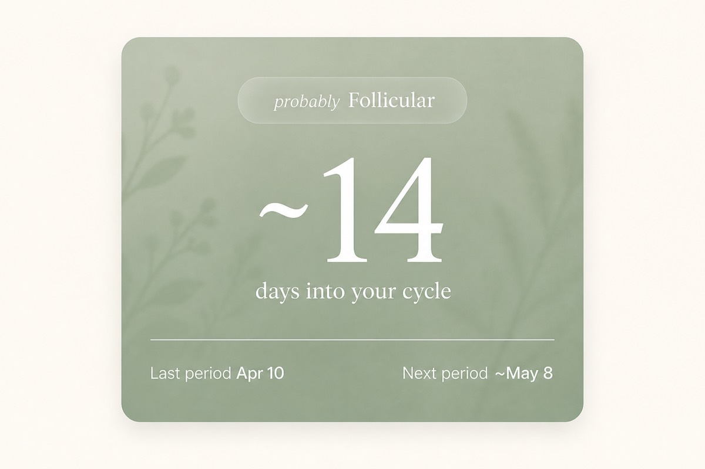

| Field | Value |
| --- | --- |
| Day | ~20 |
| Badge | probably Follicular |
| Right | Next period ~May 8 |
| Note | ~55% strip opacity · tilde day |

**App today:** Hedged only when classification is Variable — a Manual insert does not change display confidence for Regular users.

---

### 8. Unpredictable after the same data-trust gate

**Status:** Partial  
**Summary:** Irregular history (MAD ≥ 10). Spec still holds Neutral until one clean Logged→Logged cycle, then: Menstrual on bleed days; Honest card otherwise.

**Rules**

- §3.1: same gate as Regular/Variable before trusting Unpredictable
- Bleed → Menstrual treatment; else Honest “days since last period”
- Never attempts phase calculation

```mermaid
gantt
    title Unpredictable after gate
    dateFormat X
    axisFormat Day %s
    section Prior cycles MAD
    Irregular history   :crit, p1, 1, 20s
    section Gate
    Neutral waiting     :crit, g1, 1, 20s
    Clean unlock        :milestone, g2, 21, 1s
    section After unlock
    Menstrual card      :crit, a1, 21, 5s
    Honest card         :active, a2, 26, 5s
```

**Spec target UI** (Honest, non-bleed)

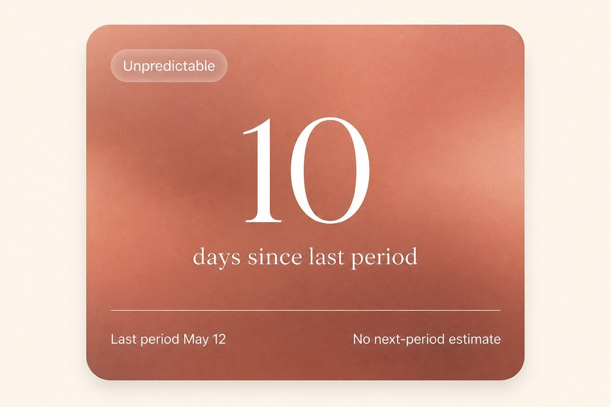

| Field | Spec | App today |
| --- | --- | --- |
| Day | 10 | 10 |
| Subtitle | days since last period | days into your cycle |
| Badge | (none / honest) | Unpredictable |
| Right | No next-period estimate | Cycles 18–45 days |

**App today:** Shows Unpredictable as soon as MAD ≥ 10 with 3 cycles — no clean-cycle gate. Non-bleed uses blush card, not plain neutral.

**Bleed-day variant (Menstrual treatment)**

---

## Part B — Period boundary detection

### 9. Spotting gap — 2× None grace

**Status:** Spec only  
**Summary:** None on days 2–3 would naively close the period; Medium on day 4 resumes before close finalizes → same episode.

**Rules**

- Close after **2 consecutive explicit None**, or **day 10** — whichever first
- Close only finalizes if the 2nd None day itself stays None
- Prevents MAD corruption from fake short cycles

```mermaid
gantt
    title Spotting gap vs grace rule
    dateFormat X
    axisFormat Day %s
    section Flow logs
    Spotting            :crit, f1, 1, 1s
    None day 1          :f2, 2, 1s
    None day 2          :f3, 3, 1s
    Medium              :done, f4, 4, 1s
    section Naive rule
    Period A            :crit, n1, 1, 1s
    Wrongly closed      :n2, 2, 2s
    Fake period B       :crit, milestone, n3, 4, 1s
    section Grace-gap rule
    Same period open    :done, g1, 1, 4s
```

**Spec target UI** (still Menstrual, same episode)

**App today:** Daily flow never opens/closes `period_logs`. End date is `estimateEnd` from typical period length at write time.

---

### 10. Silence is not None

**Status:** Spec only  
**Summary:** Skipping the app must not increment the grace-gap counter. Only an explicit None tap counts.

**Rules**

- Rule 2: only explicit None increments consecutive-None streak
- Protects inactive users from early close

```mermaid
gantt
    title Silence vs explicit None
    dateFormat X
    axisFormat Day %s
    section Flow logs
    Light               :crit, f1, 1, 1s
    Did not open        :f2, 2, 2s
    Medium              :done, f3, 4, 1s
    section Grace counter
    Stays at zero       :active, c1, 1, 4s
    section Period state
    Remains open        :done, p1, 1, 4s
```

**Spec target UI:** Menstrual card still open; grace = 0.

**App today:** No grace-gap engine — silence rule N/A until flow feeds periods.

---

### 11. Silent after Day 1 — assumed P + Home nudge

**Status:** Spec only  
**Summary:** Logs Day 1 then goes quiet. Hero advances with assumed P; after that boundary, Home asks once: “Still on your period?”

**Rules**

- Rule 3: display uses personal avg P / onboarding bucket / default 5
- Assumed P never feeds classification — only confirmed duration does
- Rule 4: one-time Home nudge after assumed P passes with no flow log

```mermaid
gantt
    title Assumed P plus Home nudge
    dateFormat X
    axisFormat Day %s
    section Logs
    Day 1 flow          :crit, l1, 1, 1s
    No logs             :l2, 2, 6s
    section Hero phase display
    Assumed Menstrual P5 :crit, h1, 1, 5s
    Provisional Follicular :done, h2, 6, 2s
    section Home nudge
    Waiting             :w1, 1, 5s
    Still on your period :active, w2, 6, 7s
```

**Spec target UI** (nudge under hero)

| Element | Copy |
| --- | --- |
| Headline | Still on your period? |
| Body | It's been a few days since your last log — just checking so Ritu can keep your pattern accurate. |
| Actions | Still going · It ended · dismiss (X) = Still going |

**App today:** Assumed end is written into the episode via `estimateEnd`; no Home confirmation nudge.

---

### 12. Confirm end date — correct classification input

**Status:** Spec only  
**Summary:** User taps “It ended” → quick relative dates → confirmed end replaces assumed P; hero reclassifies past days if needed.

**Rules**

- Follow-up screen only after “It ended”
- Confirmed end replaces assumed P for that cycle
- Hero corrects retroactively; MAD uses confirmed duration

```mermaid
gantt
    title Confirm end corrects assumed P
    dateFormat X
    axisFormat Day %s
    section Assumed P display
    Provisional P5      :crit, a1, 1, 5s
    section Confirmed end
    True bleed P3       :done, c1, 1, 3s
    Was Follicular      :c2, 4, 5s
    section Feeds MAD
    Confirmed duration  :milestone, m1, 3, 1s
```

**Follow-up screen (spec)**

| Element | Detail |
| --- | --- |
| Headline | When did it end? |
| Subhead | Approximate is fine — you can always adjust later |
| Quick options | Yesterday · 2 days ago · Today (with calendar dates) |
| Fallback | Pick a different date |
| Skip | None — once committed to “It ended” |

**App today:** Manual episode edit exists in Settings history, but not this nudge → confirm flow.

---

## Reference matrices

### When Neutral ends (hero-card §8)

Card while waiting is always **Neutral** (never Hedged).

| Manual at onboarding | Logged dates needed | Why | App today |
| --- | --- | --- | --- |
| 0 | 4 | Class min + clean arrive together | Phase card at 4 starts |
| 1 | 3 | Class min + 2 clean along the way | Phase card at 4 starts |
| 2 | 2 | Hits min with exactly 1 clean | Phase card at 4 starts |
| 3 | **2 (not 1)** | 1st logged still shares a Manual end | Phase card at 4 starts (early) |
| 4 | 2 | Eligible at signup; still need clean cycle | Phase card immediately at signup |

### Boundary close conditions

| Signal | Closes period? | Implemented? |
| --- | --- | --- |
| 1 explicit None | No — streak = 1 | No |
| 2 consecutive explicit None | Yes | No |
| Day 10 since start | Yes (hard cap) | No |
| Skipped day (silence) | No — not a signal | N/A |
| Flow after 1 None | Reset streak; stay open | No |

### Classification thresholds (committed)

| Constant | Value |
| --- | --- |
| Min completed cycles | 3 (≥ 4 starts) |
| MAD window | grow 3→5, then 6 most recent |
| Regular | MAD ≤ 4 |
| Variable | MAD 5–9 |
| Unpredictable | MAD ≥ 10 |

---

## Notable discrepancies (code vs Downloads specs)

1. **No data-trust gate** — with 4 Manual onboarding dates, the app classifies immediately and can show phase / Unpredictable cards.
2. **`onboarding_last` is Logged in code**; Downloads hero-card spec treats onboarding last period as **Manual**.
3. Trailing copy: **“weeks so far”** (calendar) vs **“weeks logged”** (frozen on inactivity).
4. Overdue / soft inactivity copy: **absent** in app.
5. Hedged after later Manual insert (§6.3): **absent** — Variable always hedged; Regular always exact once classified.
6. Entire period-boundary pipeline (grace gap, silence rule, assumed-P display vs confirmed-P for MAD, Home nudge, confirm-end screen) is **spec-only**. Closest app behavior is static `endedOn` from typical duration at write time.
